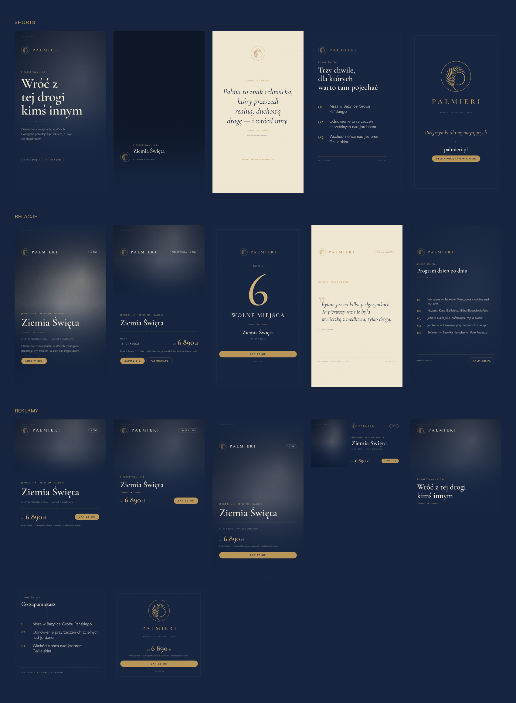

# Palmieri — system projektowy

System wizualny biura pielgrzymkowego Palmieri, zbudowany wprost z „Księgi
identyfikacji wizualnej” (wersja skrócona, 2026): barwy, kroje pisma i zasady
użycia znaku przełożone na bibliotekę komponentów i **piętnaście szablonów**
do Shorts, relacji i reklam wyjazdów.

**Chcesz po prostu zrobić grafikę?** Otwórz `studio.html` dwuklikiem: wybierasz
szablon, przeciągasz zdjęcie, poprawiasz teksty i klikasz „Pobierz PNG”.
Nie trzeba niczego instalować ani mieć internetu — cały system siedzi w tym
jednym pliku.

`index.html` to przewodnik po systemie razem z żywą galerią wszystkich szablonów.



---

## Co jest w środku

```
palmieri/
├── studio.html             ← OTWÓRZ TO: robi grafiki w przeglądarce, bez instalacji
├── index.html              przewodnik po systemie + galeria szablonów
├── podglad.png             kontaktówka wszystkich kadrów
├── brand/                  fundament — nie edytuj bez potrzeby
│   ├── tokens.css          barwy, skala pisma, odstępy, strefy bezpieczne
│   ├── palmieri.css        komponenty (.p-*)
│   ├── fonts.css + fonts/  Cormorant Garamond i Jost, lokalnie (bez CDN)
│   ├── logo-sygnet.svg     wektor znaku (dziedziczy currentColor)
│   ├── logo-sygnet-*.svg   warianty jednobarwne do Canvy, Figmy i druku
│   └── sygnet.js           wstawia wektor w elementy .p-sygnet
├── content/
│   ├── wyjazdy.js          ← TU ZMIENIASZ TEKSTY
│   └── apply.js            podstawia treść w szablony
├── templates/              15 szablonów (5 Shorts, 5 relacji, 5 reklam)
├── assets/
│   ├── photos/             tu wrzucasz własne zdjęcia
│   └── photos-zastepcze/   makiety w barwach marki
├── tools/
│   ├── export.py           eksport wsadowy szablonów do PNG
│   ├── build-studio.py     skleja studio.html po zmianach w systemie
│   ├── studio.template.html szkielet studia
│   └── make-placeholders.py generator makiet tła
└── export/                 wyniki eksportu (poza repozytorium)
```

## Szablony

| Plik | Co to jest | Format |
|---|---|---|
| `shorts-01-hook` | plansza otwierająca film | 1080 × 1920 |
| `shorts-02-belka` | belka z podpisem rozmówcy, **PNG z przezroczystością** | 1080 × 1920 |
| `shorts-03-cytat` | cytat na kremowym tle | 1080 × 1920 |
| `shorts-04-lista` | trzy punkty | 1080 × 1920 |
| `shorts-05-endcard` | plansza końcowa z wezwaniem | 1080 × 1920 |
| `story-01-zdjecie` | pełnoekranowy kadr ze zdjęciem | 1080 × 1920 |
| `story-02-oferta` | oferta wyjazdu z ceną | 1080 × 1920 |
| `story-03-ostatnie-miejsca` | komunikat o dostępności | 1080 × 1920 |
| `story-04-opinia` | opinia pielgrzyma | 1080 × 1920 |
| `story-05-program` | program dzień po dniu | 1080 × 1920 |
| `ad-01-4x5` | podstawowa reklama wyjazdu | 1080 × 1350 |
| `ad-02-1x1` | reklama kwadratowa | 1080 × 1080 |
| `ad-03-9x16` | reklama pionowa (relacje, rolki) | 1080 × 1920 |
| `ad-04-link-1200x628` | reklama linkowa i obraz Open Graph | 1200 × 628 |
| `ad-05-karuzela` | karuzela: obietnica → treść → decyzja | 3 × 1080 × 1080 |

## Codzienna praca — w przeglądarce

Otwórz `studio.html`. Panel po lewej ma wszystko, czego potrzebujesz:

- **Szablon i wyjazd** — przełączasz, podgląd zmienia się od razu.
- **Zdjęcie** — przeciągasz plik na stronę. Suwaki ustawiają kadr i siłę
  przyciemnienia, a przełącznik „Duoton marki” decyduje, czy zdjęcie ma zostać
  w naturalnych barwach, czy przejść w granatowo-złoty ton marki.
- **Treść** — panel pokazuje tylko te pola, których używa wybrany szablon.
- **Pobierz PNG** — plik ląduje w folderze Pobrane, w docelowej rozdzielczości.
  Karuzela zapisuje od razu trzy pliki.

Zmiany w studiu są jednorazowe — dotyczą tylko materiału, który właśnie robisz.
Żeby poprawić dane na stałe, edytuj `content/wyjazdy.js` (patrz niżej)
i przebuduj studio: `python3 tools/build-studio.py`.

## Praca wsadowa — komendą

Kiedy potrzebujesz kompletu materiałów dla całego wyjazdu naraz:

**1. Zmień treść.** Wszystkie teksty siedzą w `content/wyjazdy.js`. Nowy wyjazd
to skopiowanie jednego bloku i podmiana wartości — szablony podłączą się same.

**2. Podłóż zdjęcia.** Wrzuć je do `assets/photos/` i wskaż w polu `zdjecie`.
Wskazówki, jakie kadry działają najlepiej, są w `assets/photos/README.md`.

**3. Wyeksportuj.**

```bash
pip install playwright && playwright install chromium   # raz

python3 tools/export.py                    # wszystko, domyślny wyjazd → export/
python3 tools/export.py --wyjazd fatima    # komplet dla Fatimy → export/fatima/
python3 tools/export.py ad- --skala 2      # tylko reklamy, dwukrotna rozdzielczość
python3 tools/export.py --safe             # z podglądem stref interfejsu
```

### Zmiana jednorazowa, bez ruszania plików

Każde pole można nadpisać wprost w adresie szablonu — wygodne przy testach A/B:

```
templates/ad-01-4x5.html?wyjazd=rzym&cena=3%20990&cta=Ostatnie%20miejsca
```

## Zasady, które system pilnuje za ciebie

- **Granat prowadzi, złoto akcentuje** — nigdy odwrotnie. Poza paletą księgi nie
  ma w systemie żadnej innej barwy; nawet półprzezroczystości są pochodnymi
  granatu, złota i kremu.
- **Znak zawsze w jednej, płaskiej barwie**, bez cieni i gradientów.
- **Zdjęcie pod znakiem zawsze przyciemnione** — każdy kadr ze zdjęciem ma
  wbudowaną warstwę `.p-scrim`, bo księga tego wymaga.
- **Dwa kroje i nic więcej** — Cormorant Garamond mówi w imieniu marki,
  Jost podaje informacje.
- **Strefy interfejsu** — szablony do Shorts i relacji mają wbudowane wcięcia,
  więc cena i wezwanie nie chowają się pod opisem filmu ani polem odpowiedzi.
  Przełącznik w galerii (albo `--safe`) pokazuje te obszary na czerwono.

## Detale techniczne

- Cały układ skaluje się w `cqw`/`cqh` — procentach wymiarów kanwy. Ten sam
  komponent zachowuje proporcje w 1080 × 1920, 1080 × 1080 i 1200 × 628,
  a nowy format to jedna linijka w `brand/palmieri.css`.
- Fonty leżą lokalnie w `brand/fonts/` (podzbiory latin i latin-ext, żeby polskie
  znaki diakrytyczne były pewne). Nic nie ładuje się z sieci, więc eksport
  działa też bez internetu.
- Wektor sygnetu pochodzi z księgi znaku — obrys został przeniesiony bez zmiany
  proporcji.
- Katalog `export/` jest poza repozytorium; odtwarzasz go jedną komendą.
